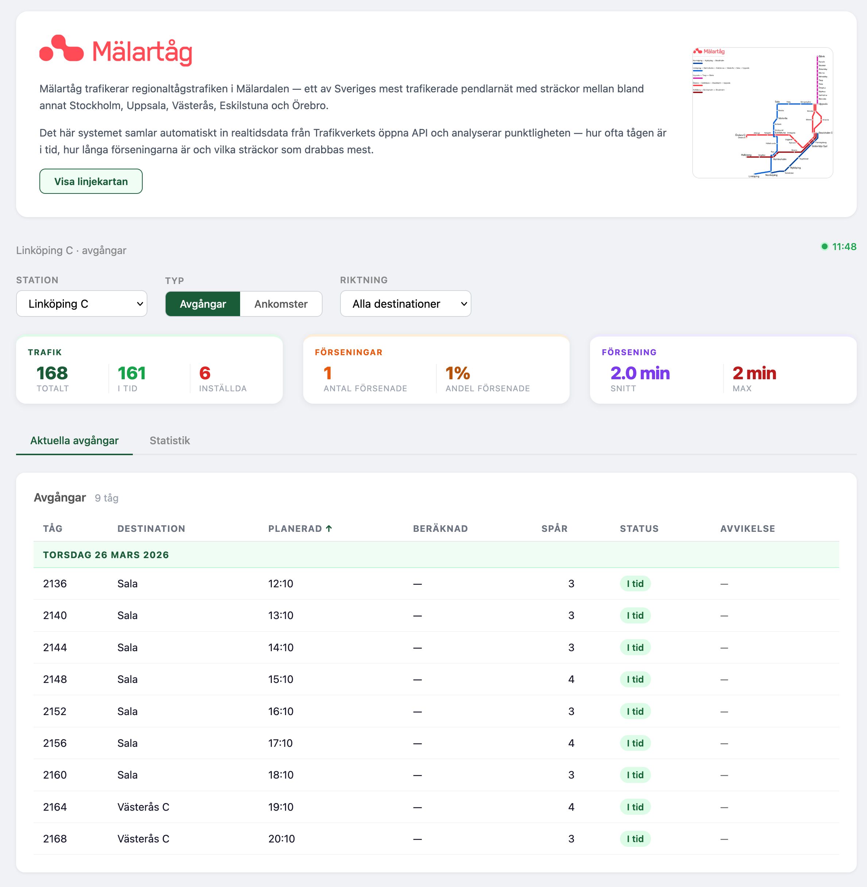
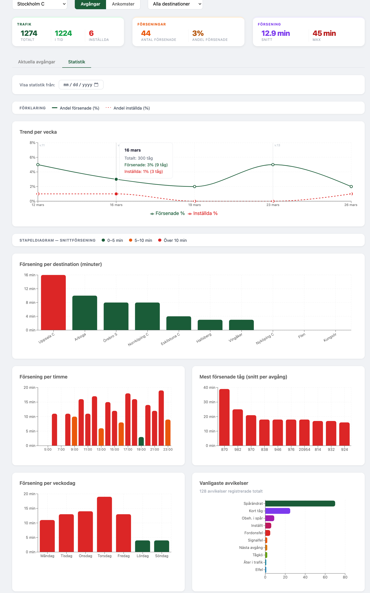

# Trainy

A web application for tracking train punctuality on the Mälartåg network in Sweden. Fetches live and historical data from the Trafikverket open API and presents it in an interactive dashboard with statistics and charts.





## Tech Stack

**Backend**
- Java 21, Spring Boot 3.4.5
- Spring Data JPA / Hibernate
- MySQL
- Trafikverket Open API

**Frontend**
- React 19, Vite
- Recharts

## Features

- Live departures and arrivals per stationne
- Delay statistics (total, on-time, delayed, canceled)
- Charts: delay trend over time, delay by destination, hour, weekday, and train number
- Most common deviation reasons
- Filter by station, direction, and destination
- Auto-refresh every 60 seconds

## Prerequisites

- Java 21
- Node.js 18+
- MySQL database
- Trafikverket API key — register for free at [trafikverket.se](https://api.trafikinfo.trafikverket.se)

## Setup

### 1. Database

Create a MySQL database and set the following environment variables:

```bash
export DB_DATABASE=jdbc:mysql://localhost:3306/your_database
export DB_USERNAME=your_user
export DB_PASSWORD=your_password
export TRAFIKVERKET_API_KEY=your_api_key
```

### 2. Backend

```bash
mvn spring-boot:run
```

The backend starts on `http://localhost:8080`. On first run, it automatically discovers active Mälartåg stations and begins polling the API every 60 seconds.

### 3. Frontend

```bash
cd frontend
npm install
npm run dev
```

The frontend starts on `http://localhost:5173` and proxies API requests to the backend.

## Importing Historical Data

To populate the database with historical data, send a POST request to the import endpoint:

```bash
curl -X POST "http://localhost:8080/train_announcements/import?hours=48"
```

The `hours` parameter controls how far back to import (default: 48).

## Running Tests

**Backend**
```bash
mvn test
```

**Frontend**
```bash
cd frontend
npm test
```

## API Endpoints

| Method | Path | Description |
|--------|------|-------------|
| GET | `/train_announcements` | Current or historical announcements |
| GET | `/train_announcements/stats` | Aggregate delay statistics |
| GET | `/train_announcements/stations` | List of stations with names |
| POST | `/train_announcements/import?hours=N` | Import N hours of historical data |

**Query parameters for GET `/train_announcements`:**
- `station` — station code (e.g. `Cst`)
- `type` — `avgang` (departure) or `ankomst` (arrival)
- `history` — `true` to return historical data
